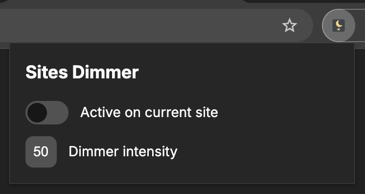

# Sites Dimmer

  

**Sites Dimmer** is a lightweight Chrome extension that helps reduce eye strain by dimming any website.  
You can enable dimming on a per-site basis and adjust the dimming intensity to your preference.

## ✨ Features

- 🌙 **Dim any website** for a more comfortable viewing experience.
- ⚙️ **Adjustable dimming intensity** (0–100).
- 📍 **Per-site activation** — only dim the sites you choose.
- 🪶 Lightweight and simple to use.
